# CIA - 4R
## quicksort
- základní verze
```python=
#!/usr/bin/env python3
import time
from random import randint as rand

def rozdel(arr, left, right):
    #zpočátku ji pivot poslední číslo v poli (ovšem není to nutnost)
    i = left #index čísla, které by si vyměňovalo pozici s kontrolovaným číslem
    for j in range(left, right): 
        if arr[j] < arr[right]:
            arr[i], arr[j] = arr[j], arr[i] #přehoď kontrolovaný prvek s i
            i += 1
    arr[i], arr[right] = arr[right], arr[i] #přehození pivota s číslem na aktuální pozici (mezi menšími a většími čísly)
    return i #vrať index pivota

def quicksort(arr, left, right):
    if right-left > 0: #pokud má pole alespoň 2 prvky
        #print(arr)
        pivot = rozdel(arr, left, right) #rozdělí pole na větší/menší relativně k pivotu a vrátí jeho index v poli
        quicksort(arr, left, pivot - 1) #rekurzivní volání pro čísla menší než pivot
        quicksort(arr, pivot + 1, right) #rekurzivní volání pro čísla větší než pivot


count = 100
zadani = [rand(0, 100) for _ in range(count)]
arr = zadani
print(arr)

start = time.time_ns()
quicksort(arr, 0, len(arr) - 1) #quicksort na celém poli
stop = time.time_ns()
print(arr)
print("Duration quicksort: ", stop-start, " ns")
```


```python=
def quicksort(arr):
    if len(arr) <= 1: #rozděleno na nejmenší jednotky
        return arr
    else:
        pivot = arr[0] #pivot vlevo
        left = []
        right = []
        for x in arr[1:]: #bez pivot prvku
            if x < pivot: #když je menší vlevo
                left.append(x)
            else: #když je větší vpravo
                right.append(x)
        return quicksort(left) + [pivot] + quicksort(right)
```
        
- srovnání algoritmů
```python=
#!/usr/bin/env python3
import time
from random import randint as rand

def quicksort(arr):
    n = 0
    y = 0
    def _rozdel(arr, left, right, n, y):
        #zpočátku ji pivot poslední číslo v poli (ovšem není to nutnost)
        i = left #index čísla, které by si vyměňovalo pozici s kontrolovaným číslem
        for j in range(left, right):
            y += 1
            if arr[j] < arr[right]: #pokud je menší než pivot
                arr[i], arr[j] = arr[j], arr[i] #přehoď kontrolovaný prvek s i
                i += 1
        arr[i], arr[right] = arr[right], arr[i] #přehození pivota s číslem na aktuální pozici (mezi menšími a většími čísly)
        return i, n, y #vrať index pivota

    def _recursive(arr, left, right, n, y):
        n += 1
        if right-left > 0: #pokud má pole alespoň 2 prvky
            #print(arr)
            pivot, n, y = _rozdel(arr, left, right, n, y) #rozdělí pole na větší/menší relativně k pivotu a vrátí jeho index v poli
            _recursive(arr, left, pivot - 1, n, y) #rekurzivní volání pro čísla menší než pivot
            _recursive(arr, pivot + 1, right, n, y) #rekurzivní volání pro čísla větší než pivot
    _recursive(arr, 0, len(arr) - 1, n, y)
    return arr, n, y

def shakersort(cisla):
    n = len(cisla)-1
    x = 0
    y = 0
    pokracovat = True
    while pokracovat: # ukončit po cyklu beze změn
        pokracovat = False
        #print("Průběh:", x)
        for i in range(x, n-x): # zmenšit výběr kontrolovaných prvků o jeden na každé straně s každým cyklem
            y += 1
            if(cisla[i] > cisla[i+1]):
                cisla[i], cisla[i+1] = cisla[i+1], cisla[i]
                pokracovat = True
            #print("  {} - pozice [{}, {}]".format(cisla, i, i+1))
        for i in reversed(range(x, n-x-1)): # průchod opačným směrem s tím, že se již teď může vynechat poslední prvek v aktuálním výběru (kontroloval se jako poslední v pčedchozím průchodu)
            y += 1
            if(cisla[i] > cisla[i+1]):
                cisla[i], cisla[i+1] = cisla[i+1], cisla[i]
                pokracovat = True
            #print("  {} - pozice [{}, {}]".format(cisla, i, i+1))
        x+=1
    return cisla, x+1, y

def bubblesort(cisla):
    n = len(cisla)-1
    y = 0
    for x in range(n):
        #print("Průběh:", x)
        for i in range(n-x):
            y += 1
            if(cisla[i] > cisla[i+1]):
                cisla[i], cisla[i+1] = cisla[i+1], cisla[i]
            #print("  {} - pozice [{}, {}]".format(cisla, i, i+1))
    return cisla, n+1, y

def benchmark():
    pole = [
        [17, 99, 95, 56, 12, 81, 73, 25, 93, 23],
        [1, 2, 5, 9, 15, 22, 36, 55, 66, 75],
        [1, 6, 8, 20, 32, 7, 11, 44, 12, 22]
    ]
    for i in range(len(pole)):
        print("Testuji pole: ", i)
        zadani = []
        zadani.append(pole[i])
        
        start = time.perf_counter_ns()
        x, n, y = quicksort(zadani)
        stop = time.perf_counter_ns()
        print("quicksort: ", stop-start, " ns")
        print("    prubehy: ", n)
        print("    porovnani: ", y)

        start = time.perf_counter_ns()
        x, p, s = shakersort(zadani)
        stop = time.perf_counter_ns()
        print("shakersort: ", stop-start, " ns")
        print("    prubehy: ", p)
        print("    porovnani: ", p)

        start = time.perf_counter_ns()
        x, p, s = bubblesort(zadani)
        stop = time.perf_counter_ns()
        print("bubblesort: ", stop-start, " ns")
        print("    prubehy: ", p)
        print("    porovnani: ", p)
        print("----")
benchmark()
```
- improved benchmark:
```python=
#!/usr/bin/env python3
import time
import random

recursive_call_count = 0
comp_count = 0

def bubblesort(arr):
    ccount = 0
    n = len(arr)
    for i in range(n):
        for j in range(0, n-i-1):
            ccount += 1
            if arr[j] > arr[j+1]:
                arr[j], arr[j+1] = arr[j+1], arr[j]
    return ccount

def shakersort(arr):
    ccount = 0
    n = len(arr)
    left, right = 0, n-1
    while left < right:
        ccount += 1
        for i in range(left, right):
            ccount += 1
            if arr[i] > arr[i+1]:
                arr[i], arr[i+1] = arr[i+1], arr[i]
        right -= 1
        for i in range(right, left, -1):
            ccount += 1
            if arr[i] < arr[i-1]:
                arr[i], arr[i-1] = arr[i-1], arr[i]
        left += 1
    return ccount

def quicksort(arr):
    global recursive_call_count
    global comp_count
    comp_count += 1
    if len(arr) <= 1:
        return arr
    else:
        pivot = arr[0]
        left = []
        right = []
        for x in arr[1:]:
            comp_count += 1
            if x < pivot:
                left.append(x)
            else:
                right.append(x)
        recursive_call_count += 1
        return quicksort(left) + [pivot] + quicksort(right)

def benchmark(sort_func, arr):
    start_time = time.time()
    x = sort_func(arr.copy())
    end_time = time.time()
    return end_time - start_time, x

def generate_random_data(size):
    return [random.randint(1, 10000) for _ in range(size)]

def main():
    data_sizes = [1000, 5000, 10000]
    
    for size in data_sizes:
        data = generate_random_data(size)
        
        print(f"Data size: {size}")
        
        bubble_time, c = benchmark(bubblesort, data)
        print(f"Bubblesort time: {bubble_time:.6f} seconds")
        print(f"  Comparations: {c}")
        print(f"  Percentage time: {100}")
        print(f"  Percentage comp: {100}")
        shaker_time, b = benchmark(shakersort, data)
        print(f"Shakersort time: {shaker_time:.6f} seconds")
        print(f"  Comparations: {b}")
        print(f"  Percentage time: {(shaker_time/bubble_time)*100}")
        print(f"  Percentage comp: {(b/c)*100}")
        global recursive_call_count
        recursive_call_count = 0
        global comp_count
        comp_count = 0
        
        quick_time, a = benchmark(quicksort, data)
        print(f"Quicksort time: {quick_time:.6f} seconds")
        print(f"  Recursive calls: {recursive_call_count}")
        print(f"  Comparations: {comp_count}")
        print(f"  Percentage time: {(quick_time/bubble_time)*100}")
        print(f"  Percentage comp: {(comp_count/c)*100}")
        print("------")

if __name__ == "__main__":
    main()
```
## Výsledky

```mermaid
gantt
    title Time (len: 1000, array: unsorted)
    dateFormat  X
    axisFormat %s
    section bubblesort
    43432200 ns   : 0, 100
    section shakersort
    44816500 ns   : 0, 104
    section quicksort
    1438900 ns   : 0, 4
```
```mermaid
gantt
    title Number of comparations (len: 1000, array: sorted)
    dateFormat  X
    axisFormat %s
    section bubblesort
    499500   : 0, 100
    section shakersort
    500000   : 0, 101
    section quicksort
    501499   : 0, 101
```
```mermaid
gantt
    title Time (len: 1000, array: sorted)
    dateFormat  X
    axisFormat %s
    section bubblesort
    28497900 ns   : 0, 100
    section shakersort
    30135100 ns   : 0, 106
    section quicksort
    44397400 ns   : 0, 156
```
```mermaid
gantt
    title Number of comparations (len: 1000, array: semi-sorted)
    dateFormat  X
    axisFormat %s
    section bubblesort
    499500   : 0, 100
    section shakersort
    500000   : 0, 101
    section quicksort
    11507   : 0, 3
```


```mermaid
gantt
    title Number of comparations (len: 1000, array: unsorted)
    dateFormat  X
    axisFormat %s
    section bubblesort
    499500   : 0, 100
    section shakersort
    500000   : 0, 101
    section quicksort
    0   : 0, 0
```
```mermaid
gantt
    title Time (len: 1000, array: unsorted)
    dateFormat  X
    axisFormat %s
    section bubblesort
    44368400 ns   : 0, 100
    section shakersort
    44365800 ns   : 0, 100
    section quicksort
    1123100 ns   : 0, 3
```
```mermaid
gantt
    title Number of comparations (len: 1000, array: sorted)
    dateFormat  X
    axisFormat %s
    section bubblesort
    499500   : 0, 100
    section shakersort
    500000   : 0, 101
    section quicksort
    0   : 0, 0
```
```mermaid
gantt
    title Time (len: 1000, array: sorted)
    dateFormat  X
    axisFormat %s
    section bubblesort
    28094300 ns   : 0, 100
    section shakersort
    30238900 ns   : 0, 108
    section quicksort
    44580000 ns   : 0, 159
```
```mermaid
gantt
    title Number of comparations (len: 1000, array: semi-sorted)
    dateFormat  X
    axisFormat %s
    section bubblesort
    499500   : 0, 100
    section shakersort
    500000   : 0, 101
    section quicksort
    0   : 0, 0
```

---

```mermaid
gantt
    title Time (len: 1000, array: unsorted)
    dateFormat  X
    axisFormat %s
    section bubblesort
    44911500 ns   : 0, 100
    section shakersort
    45440500 ns   : 0, 102
    section quicksort
    1152700 ns   : 0, 3
```

```mermaid
gantt
    title Time (len: 1000, array: sorted)
    dateFormat  X
    axisFormat %s
    section bubblesort
    27719300 ns   : 0, 100
    section shakersort
    30067700 ns   : 0, 109
    section quicksort
    45797100 ns   : 0, 166
```

```mermaid
gantt
    title Time (len: 1000, array: semi-sorted)
    dateFormat  X
    axisFormat %s
    section bubblesort
    41923900 ns   : 0, 100
    section shakersort
    43360100 ns   : 0, 104
    section quicksort
    1048800 ns   : 0, 3
```

## Benchmark v2
```python=
#!/usr/bin/env python3
import time
import random
import math

recursive_call_count = 0
comp_count = 0

def bubblesort(arr):
    ccount = 0
    n = len(arr)
    for i in range(n):
        for j in range(0, n-i-1):
            ccount += 1
            if arr[j] > arr[j+1]:
                arr[j], arr[j+1] = arr[j+1], arr[j]
    return ccount

def shakersort(arr):
    ccount = 0
    n = len(arr)
    left, right = 0, n-1
    while left < right:
        ccount += 1
        for i in range(left, right):
            ccount += 1
            if arr[i] > arr[i+1]:
                arr[i], arr[i+1] = arr[i+1], arr[i]
        right -= 1
        for i in range(right, left, -1):
            ccount += 1
            if arr[i] < arr[i-1]:
                arr[i], arr[i-1] = arr[i-1], arr[i]
        left += 1
    return ccount

def quicksort(arr):
    n = 0
    y = 0
    def _rozdel(arr, left, right, n, y):
        #zpočátku ji pivot poslední číslo v poli (ovšem není to nutnost)
        i = left #index čísla, které by si vyměňovalo pozici s kontrolovaným číslem
        for j in range(left, right):
            y += 1
            if arr[j] < arr[right]: #pokud je menší než pivot
                arr[i], arr[j] = arr[j], arr[i] #přehoď kontrolovaný prvek s i
                i += 1
        arr[i], arr[right] = arr[right], arr[i] #přehození pivota s číslem na aktuální pozici (mezi menšími a většími čísly)
        return i, n, y #vrať index pivota

    def _recursive(arr, left, right, n, y):
        n += 1
        if right-left > 0: #pokud má pole alespoň 2 prvky
            #print(arr)
            pivot, n, y = _rozdel(arr, left, right, n, y) #rozdělí pole na větší/menší relativně k pivotu a vrátí jeho index v poli
            _recursive(arr, left, pivot - 1, n, y) #rekurzivní volání pro čísla menší než pivot
            _recursive(arr, pivot + 1, right, n, y) #rekurzivní volání pro čísla větší než pivot
    _recursive(arr, 0, len(arr) - 1, n, y)
    return arr, n, y

def benchmark(sort_func, arr):
    start_time = time.perf_counter_ns()
    x = sort_func(arr.copy())
    end_time = time.perf_counter_ns()
    return end_time - start_time, x

def main():
    data_sizes = [1000]
    datas = [[], [], []]
    names = ["unsorted", "sorted", "semi-sorted"]
    
    for size in data_sizes:
        datas[0] = [random.randint(1, 10000) for _ in range(size)] #unsorted
        datas[1] = [_ for _ in range(size)] #sorted
        datas[2] = [random.randint(1, 10000) for _ in range(int(size/2))]*2 #semi-sorted
        for i in range(len(datas)):
            data = datas[i]
            #print(f"Data size: {size}, array id: {i}")
        
            bubble_time, c = benchmark(bubblesort, data)
            #print(f"Bubblesort time: {bubble_time:.6f} seconds")
            #print(f"  Comparations: {c}")
            #print(f"  Percentage time: {100}")
            #print(f"  Percentage comp: {100}")
            shaker_time, b = benchmark(shakersort, data)
            #print(f"Shakersort time: {shaker_time:.6f} seconds")
            #print(f"  Comparations: {b}")
            #print(f"  Percentage time: {(shaker_time/bubble_time)*100}")
            #print(f"  Percentage comp: {(b/c)*100}")
            global recursive_call_count
            recursive_call_count = 0
            global comp_count
            comp_count = 0
        
            quick_time, a = benchmark(quicksort, data)
            #print(f"Quicksort time: {quick_time:.6f} seconds")
            #print(f"  Recursive calls: {recursive_call_count}")
            #print(f"  Comparations: {comp_count}")
            #print(f"  Percentage time: {(quick_time/bubble_time)*100}")
            #print(f"  Percentage comp: {(comp_count/c)*100}")
            print(f"```mermaid\ngantt\n    title Number of comparations (len: {size}, array: {names[i]})\n    dateFormat  X\n    axisFormat %s\n    section bubblesort\n    {c}   : 0, 100\n    section shakersort\n    {b}   : 0, {math.ceil((b/c)*100)}\n    section quicksort\n    {comp_count}   : 0, {math.ceil((comp_count/c)*100)}\n```")
            print(f"```mermaid\ngantt\n    title Time (len: {size}, array: {names[i]})\n    dateFormat  X\n    axisFormat %s\n    section bubblesort\n    {bubble_time} ns   : 0, 100\n    section shakersort\n    {shaker_time} ns   : 0, {math.ceil((shaker_time/bubble_time)*100)}\n    section quicksort\n    {quick_time} ns   : 0, {math.ceil((quick_time/bubble_time)*100)}\n```")
            #print("------")

if __name__ == "__main__":
    main()
    
```
